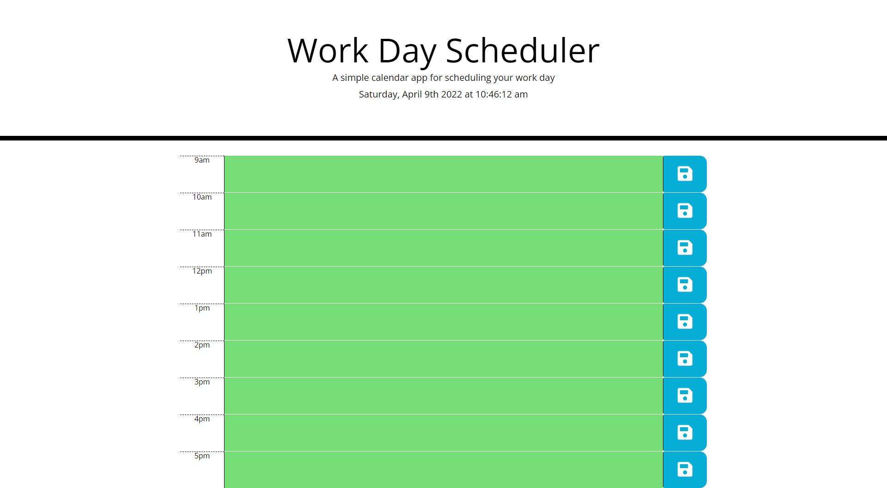

# dayplanner

This project challened me to create a simple day-planner created with Bootstrap and JQuery. This page displays the current date and time at the top of the screen and allows users to input their desired notes into a time-block.

Any notes entered into the center column will be saved to the page upon the save icon on the right side of the page being clicked. Once the user returns the page, they will find their notes in the same time blocks that they were entered.

Additionally, this day-planner uses a function that utilizes the current time of day to change the time block entries' colors based on whether or not that block is within the current hour, or if that hour is coming up or has since past. 

To elaborate on the styling, if it is 10am when viewing the page, the 10am block should be styled with a red background to indicate that it is the current hour, whereas 11am-5pm should be styled green to indicate they're in the future and 9am should be grey to show that time block has passed.

Maintained by: John Guzzetta

-Project Links-

Github Pages: https://guzzemetti.github.io/dayplanner/

Github Repo: https://github.com/Guzzemetti/dayplanner

